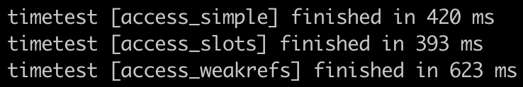

# Advance HW5

### 1. Сравнение использования weakref и слотов

create


access



change


delete


Можно сделать вывод, что slots ускоряет выполнение операций. А использование weakref замедляет работу.

### 2. Профилирование
cProfile:


Логи по времени работы cProfile сходятся с измерениями, полученными с использованием timeit декоратора. 

memory_profiler:


С использованием memory_profiler видно, что реализация на слотах потребляет намного меньше памяти, чем обычная. Также реализация с weakref потребляет меньше памяти, чем обычная.

### 3. Декоратор для профилирования
```bash
python profile_decorator.py
```

### 4. Линтеры

#### Проверка pylint
```bash
pylint .
```

#### Проверка flake8
```bash
flake8 .
```

#### Проверка black
```bash
black --check .
```

#### Использовние Black
```bash
black .
```